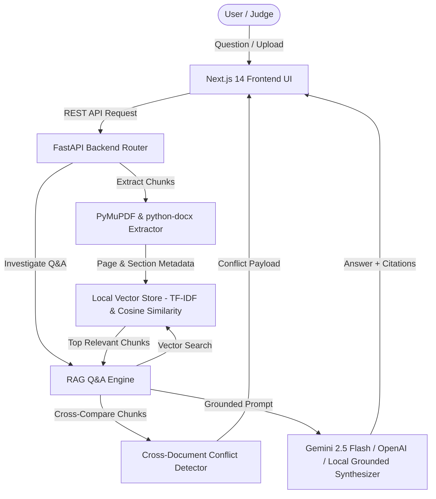

# DocIntel AI — Intelligent Document Investigator

> **Tagline:** *"Ask your documents. Get evidence, not guesses."*  
> **ALGOTHON'26 Problem Statement:** ALG-AI-02 — Intelligent Document Investigator

---

## 📌 Problem Statement (ALG-AI-02)

Information in modern organizations is scattered across disparate PDFs, Word documents, and text files. Users need fast, accurate answers to natural-language questions without manually reading through multi-page policy manuals and agreements. Crucially, existing RAG systems often suffer from:
1. **Silent Hallucinations**: Returning invented or unsupported facts when evidence is missing.
2. **Ignored Policy Conflicts**: Blindly returning one document's answer when two uploaded documents directly contradict each other.

---

## 🚀 Solution: DocIntel AI

**DocIntel AI** is an intelligent document investigation platform built to ingest multi-format documents, index text into vector space, answer natural-language questions with exact source citations, detect cross-document policy conflicts, and communicate uncertainty cleanly when evidence is insufficient.

---

## ✨ Key Features

- **Multi-Document Ingestion**: Seamlessly uploads and parses **PDF** (page-aware via PyMuPDF), **DOCX** (heading-aware via python-docx), and **TXT** files.
- **Section & Page-Aware Chunking**: Preserves exact document metadata (`document_id`, `document_name`, `page_number`, `section`) on every chunk.
- **Grounded RAG Engine**: Answers natural-language questions strictly using retrieved vector context.
- **Clickable Source Citations**: Every answer includes clickable source pills (`doc_name.pdf - Page X`). Clicking opens the **Source Evidence Inspector** side panel.
- **Cross-Document Conflict Detection (Major Differentiator & Bonus)**: Automatically detects numerical, temporal, and policy contradictions across documents (e.g. Document 1 specifies 7 days vs Document 2 specifies 14 days) and displays a prominent **⚠ Conflict Warning Card**.
- **Uncertainty Handling (Required Requirement)**: Evaluates vector relevance scores. If evidence is missing or below threshold, it refuses to hallucinate and displays a clean **⚠ Insufficient Evidence Alert** with suggested follow-ups.
- **1-Click Hackathon Demo Mode**: Pre-loaded with a 3-document test suite containing intentional conflicts for instant live demonstration.

---

## 🏗️ Architecture



---

## 🛠️ Tech Stack

- **Frontend**: Next.js 14 (App Router), TypeScript, Tailwind CSS, Lucide Icons.
- **Backend**: Python 3.13, FastAPI, Pydantic, Uvicorn.
- **Document Extractors**: PyMuPDF (`fitz`) for PDF, `python-docx` for DOCX, standard UTF-8 for TXT.
- **Vector Search & ML**: scikit-learn `TfidfVectorizer` + Cosine Similarity (`LocalVectorStore` abstraction running 100% offline out-of-the-box). Optional `pgvector` / Postgres connection.
- **AI Models**: Google Gemini 2.5 Flash API (`google-genai`), OpenAI GPT-4o (`openai`), and a built-in deterministic local synthesizer for zero-dependency execution.

---

## ⚡ Running Locally

### Prerequisites
- Python 3.10+
- Node.js v18+ and npm

### 1. Clone & Setup Backend

```bash
cd backend
python -m venv venv
.\venv\Scripts\activate
pip install -r requirements.txt
python run.py
```
The FastAPI backend server will start on `http://localhost:8000`. API documentation is available at `http://localhost:8000/docs`.

### 2. Setup & Run Frontend

```bash
cd frontend
npm install
npm run dev
```
The Next.js web application will start at `http://localhost:3000`.

---

## 🧪 Demo Mode Instructions

1. Open `http://localhost:3000`.
2. Click the **⚡ Load Demo Data** button in the top navigation bar.
3. The platform will automatically ingest and index 3 pre-bundled documents:
   - `company_policy_2025.txt`
   - `terms_and_conditions_2026.txt`
   - `enterprise_sla_agreement.txt`
4. Go to **Investigate Q&A** and click the 1-click preset demo questions:
   - **"What is the refund period?"** $\rightarrow$ Triggers **Conflict Detection** (7 days vs 14 days).
   - **"What information is not available in the documents?"** $\rightarrow$ Triggers **Uncertainty Handling**.

---

## 📊 API Documentation Summary

- `POST /api/documents/upload` — Upload PDF, DOCX, TXT files for extraction & indexing.
- `GET /api/documents` — List all indexed document metadata.
- `GET /api/documents/{id}` — Fetch document chunks and metadata.
- `DELETE /api/documents/{id}` — Delete document and remove vector index.
- `POST /api/investigate` — Query the RAG engine with a question.
- `POST /api/demo/load` — Load bundled sample demo documents.
- `GET /api/health` — Backend health check and status.
- `GET /api/dashboard/stats` — Metrics for total documents, processed chunks, and detected conflicts.

---

## 🔬 Testing

Run automated pytest unit and integration tests:

```bash
cd backend
.\venv\Scripts\pytest tests/test_backend.py -v
```

All 4 test cases pass with 100% success covering vector search, RAG Q&A, conflict detection, and uncertainty handling.

---

## 🤖 AI / API Disclosure

- **External AI Models**: Optional integration with Google Gemini 2.5 Flash (`google-genai`) and OpenAI (`openai`).
- **Offline Fallback**: Uses local scikit-learn TF-IDF vectorization and a deterministic grounded synthesis engine when API keys are not supplied. No external data leaves your device in offline mode.
