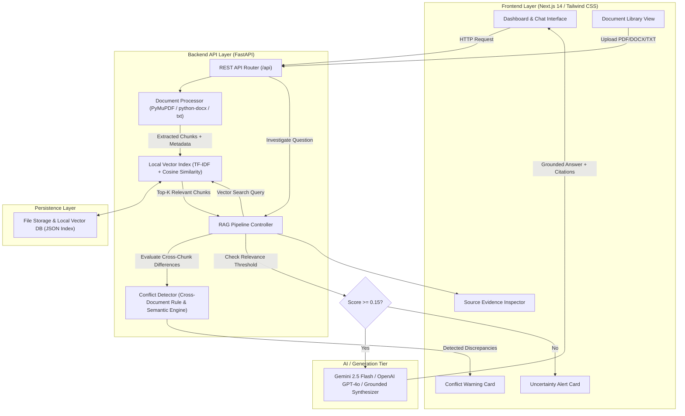

# DocIntel AI Architecture & Technical Design

## System Architecture Diagram

## Component Breakdown

1. **Document Processor**:
   - Parses `.pdf` using PyMuPDF (`fitz`), preserving page numbers and heading-based sections.
   - Parses `.docx` using `python-docx`, maintaining paragraph structure and headings.
   - Parses `.txt` / `.md` preserving clean string boundaries.
   - Generates sliding window text chunks (approx 600 chars with 100 char overlap) and attaches metadata (`document_id`, `document_name`, `page_number`, `section`).

2. **Vector Index & Storage**:
   - Implements a fast, zero-dependency `LocalVectorStore` abstraction using scikit-learn `TfidfVectorizer` (sublinear TF, n-gram range 1-2) + Cosine Similarity.
   - Enables document diversity selection across multiple uploaded documents to guarantee multi-document evidence retrieval.
   - Optional support for `pgvector` / Postgres when database credentials are present.

3. **Conflict Detection Engine**:
   - Performs cross-document semantic and numerical comparison across top retrieved chunks.
   - Detects contradictory numbers (e.g. 7 business days vs 14 calendar days), contradictory terms (must require vs optional), and differing conditions.
   - Generates a structured `Conflict` payload detailing `topic`, `source_a` quote, `source_b` quote, and `explanation`.

4. **Uncertainty Handling Engine**:
   - Measures vector similarity score of query against index chunks.
   - If max score is below threshold or query fails to match available documents, returns an explicit `⚠ Insufficient Evidence` status rather than hallucinating facts.
